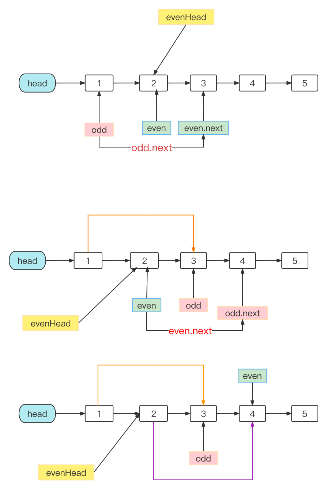

## Algorithm：

#### [328. 奇偶链表](https://leetcode.cn/problems/odd-even-linked-list/)

解题思路：

1. 因为是奇偶索引的节点进行排序后，进行奇-偶拼接，所以还需要指向偶链表的指针。

2. 维护两个指针 `odd` 和 `even` 分别指向奇数节点和偶数节点。



#### [148. 排序链表](https://leetcode.cn/problems/sort-list/)

解题思路：

采用自顶向下进行归并排序：

1. 利用快慢双指针进行拆飞链表
2. 对两个链表进行排序
3. 合并两个链表

## Review： [独立 transform 属性](https://web.dev/css-individual-transform-properties/)

独立 transform 属性： translate， rotate，scale。已在 Chrome 104、Safari 和 Firefox 已支持（Edge 暂不支持）。并且在@keyframes 中可以直接针对transform的每个特性进行转换，不用计算中间复杂值。

以前的写法：

```
.target {
  transform: translateX(50%) rotate(30deg) scale(1.2);
}
@keyframes anim {
  0% { transform: translateX(0%); }
  5% { transform: translateX(5%) rotate(90deg) scale(1.2); }
  10% { transform: translateX(10%) rotate(180deg) scale(1.2); }
  90% { transform: translateX(90%) rotate(180deg) scale(1.2); }
  95% { transform: translateX(95%) rotate(270deg) scale(1.2); }
  100% { transform: translateX(100%) rotate(360deg); }
}
```

现在的写法： 

其中无论写的顺序如何，最终都是按translate -> rotate ->scale进行编译。

```
.target {
  translate: 50% 0;
  rotate: 30deg;
  scale: 1.2;
}
@keyframes anim {
  0% { translate: 0% 0; }
  100% { translate: 100% 0; }

  0%, 100% { scale: 1; }
  5%, 95% { scale: 1.2; }

  0% { rotate: 0deg; }
  10%, 90% { rotate: 180deg; }
  100% { rotate: 360deg; }
}
```


## **Review：[Import maps](https://www.honeybadger.io/blog/import-maps/)**

新增js对于第三方包的导入方式，相比较与之前的

```
<script type="module">
  import dayjs from 'dayjs';

  console.log(dayjs('2019-01-25').format('YYYY-MM-DDTHH:mm:ssZ[Z]'));
</script>
```

```
const dayjs = require('dayjs') // CommonJS

import dayjs from 'dayjs'; // webpack
```

import maps支持：

1. cdn， 文件， 包

```
<script type="importmap">
{
  "imports": {
    "react": "https://cdn.skypack.dev/react@17.0.1",
    "react-dom": "https://cdn.skypack.dev/react-dom",
    "square": "./modules/square.js",
    "lodash": "/node_modules/lodash-es/lodash.js"
  }
}
</script>
```

2. 支持整个包引入

```
<script type="importmap">
{
  "imports": {
    "lodash/": "/node_modules/lodash-es/"
  }
}
</script>
```

3. 动态引入

```
<script>
  const importMap = {
    imports: {
      lazyload: 'IntersectionObserver' in window
        ? './lazyload.js'
        : './lazyload-fallback.js',
    },
  };

  const im = document.createElement('script');
  im.type = 'importmap';
  im.textContent = JSON.stringify(importMap);
  document.currentScript.after(im);
</script>

```

4. 引入文件，url是相对路径

```
<script type="importmap" src="importmap.json"></script>
```

对于浏览器是否支持这个特性

```
if (HTMLScriptElement.supports && HTMLScriptElement.supports('importmap')) {
  // import maps is supported
}
```

