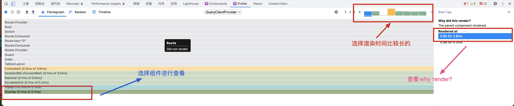

# Algorithm：

#### [面试题 02.05. 链表求和](https://leetcode.cn/problems/sum-lists-lcci/)

#### [面试题 08.05. 递归乘法](https://leetcode.cn/problems/recursive-mulitply-lcci/)

这道题比较有趣的事用二进制表示十进制，利用左右移和&进行实现乘法。

# Review

[The minimum TypeScript you need for React](https://ente.io/blog/tech/typescript-for-react/)

作者描述的是如何从：

```tsx
import React from 'react';

const Hello = () => {
    return <div>Hello</div>;
};
```

在react正确的使用ts：

```tsx
import React, { HTMLAttributes, PropsWithChildren } from 'react';
interface HelloProps extends HTMLAttributes<HTMLDivElement> {
    name: string;
}

const Hello: React.FC<PropsWithChildren<HelloProps>> = ({
    name,
    children,
    ...rest}) => {
    return (
        <div>
            <div {...rest}>{`Hello, ${name}!`}</div>            {children}
        </div>
    );
};
```

[Why React Re-Renders](https://www.joshwcomeau.com/react/why-react-re-renders/)

这篇文章深入探讨了为什么 React 能够以一种可访问的、容易遵循的方式进行渲染。从这篇文章主要复习到的是[React Profiler 介绍](https://zh-hans.reactjs.org/blog/2018/09/10/introducing-the-react-profiler.html)

主要通过react devtool的profiler进行记录应用程序的渲染过程以及花费时间。可以从工具中得知why did this render.从图可以更好的看出渲染的过程以及找出渲染的原因。

